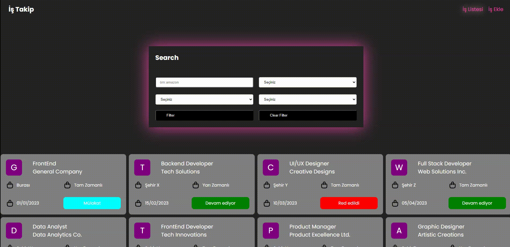

<!-- PROJECT LOGO -->
<br />
<div align="center" id="readme-top">
  <a href="https://github.com/sameteyuboglu/react-is-takip">
    
  </a>

<h3 align="center">REACT İş Takip </h3>

  <p align="center">
    redux, redux thunk , reducer, actions ,axios, react-tostify
  </p>
</div>


### Kurulumlar

```sh
npm i redux
```

```sh
npm i react-router-dom
```

```sh
npm i axios
```
```sh
npm i react-toastify
```

```sh
npm i uuid
```

```sh
npm i
npm run dev
```

<p align="right">(<a href="#readme-top">Başa Dön</a>)</p>


## Son Durum

